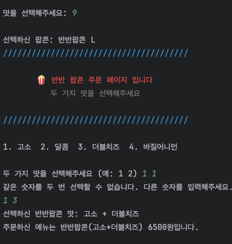
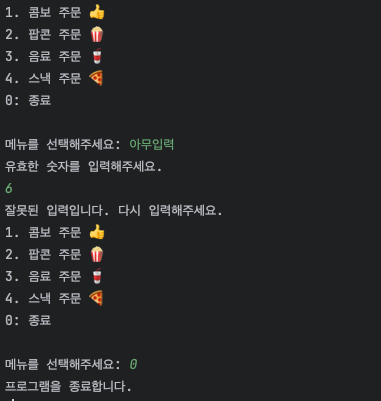
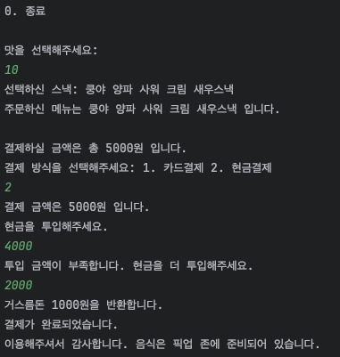
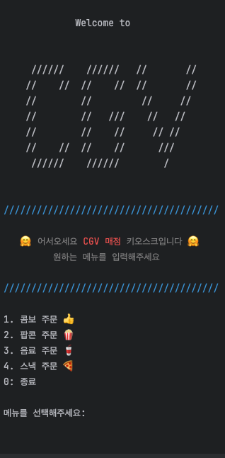
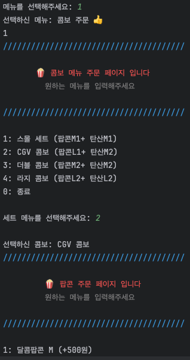
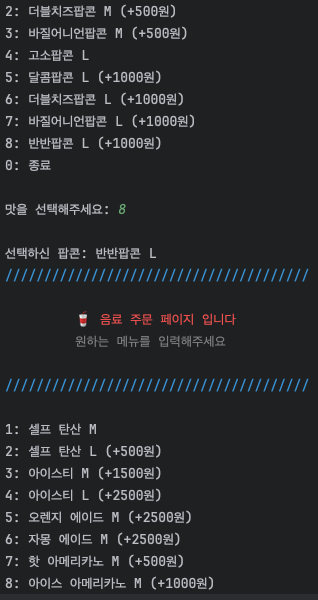
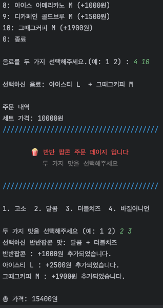
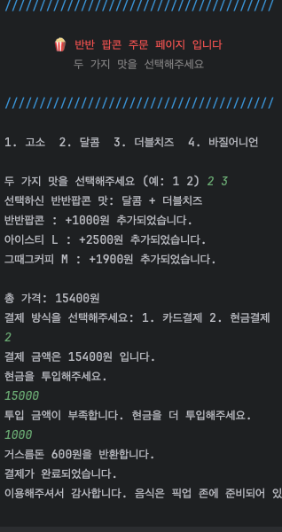
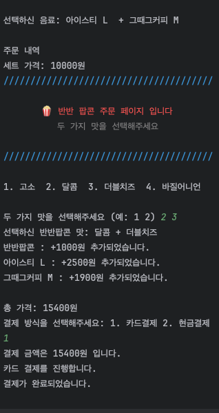

# 영화관 음식 주문 시스템 💁‍♂️🍿🥤
- 이 프로젝트는 2024년 5월 카카오테크 부트캠프 클라우드 in JEJU 과정에서 진행한 프로젝트입니다.   
- Java를 사용한 CLI 기반의 CGV 매점 키오스크 주문 서비스입니다.    
- 사용자는 세트 메뉴, 팝콘, 음료, 스낵 등을 선택하고 결제까지 진행할 수 있습니다.  
- 프로젝트는 객체 - 지향 설계를 통해 각 기능을 모듈화하였으며, 패키지 구조를 통해 기능별로 클래스를 분류하였습니다.


## 1. 패키지 구조 
```
java-cli-cgv
│
├── com
│   ├── hello
│   │   ├── Main.java
│   │   ├── SelectBeverage.java
│   │   ├── SelectCombo.java
│   │   ├── SelectHalfPopCorn.java
│   │   ├── SelectPopCorn.java
│   │   ├── SelectSnack.java
│   │   └── Welcome.java
│   │
│   ├── order
│   │   ├── BeverageOrderHandler.java
│   │   ├── HandleMenu.java
│   │   ├── Order.java
│   │   ├── PopcornOrderHandler.java
│   │   ├── SetMenuHandler.java
│   │   └── SnackOrderHandler.java
│   │
│   ├── payment
│   │   ├── CardPaymentHandler.java
│   │   ├── CashPaymentHandler.java
│   │   └── PaymentHandler.java
│   │
│   └── product
│       ├── Beverage.java
│       ├── BeverageList.java
│       ├── Combo.java
│       ├── ComboList.java
│       ├── Popcorn.java
│       ├── PopcornList.java
│       ├── Product.java
│       ├── Snack.java
│       └── SnackList.java
```
## 2. 클래스 별 기능 요약
### com.hello
- **Main.java**: 프로그램의 시작점으로 사용자 입력을 받아 메뉴를 선택하고 각 기능으로 이동합니다.
- **SelectBeverage.java**: 음료 메뉴 선택을 처리하는 클래스입니다.
- **SelectCombo.java**: 콤보 메뉴 선택을 처리하는 클래스입니다.
- **SelectHalfPopCorn.java**: 반반 팝콘 선택을 처리하는 클래스입니다.
- **SelectPopCorn.java**: 팝콘 메뉴 선택을 처리하는 클래스입니다.
- **SelectSnack.java**: 스낵 메뉴 선택을 처리하는 클래스입니다.
- **Welcome.java**: 환영 메시지 및 초기 메뉴 선택을 처리하는 클래스입니다.

### com.order
- **BeverageOrderHandler.java**: 음료 주문을 처리하는 클래스입니다.
- **HandleMenu.java**: 각 메뉴 선택을 처리하는 인터페이스입니다.
- **Order.java**: 주문을 처리하는 클래스입니다.
- **PopcornOrderHandler.java**: 팝콘 주문을 처리하는 클래스입니다.
- **SetMenuHandler.java**: 세트 메뉴 주문을 처리하는 클래스입니다.
- **SnackOrderHandler.java**: 스낵 주문을 처리하는 클래스입니다.

### com.payment
- **CardPaymentHandler.java**: 카드 결제를 처리하는 클래스입니다.
- **CashPaymentHandler.java**: 현금 결제를 처리하는 클래스입니다.
- **PaymentHandler.java**: 결제 처리를 위한 인터페이스입니다.

### com.product
- **Beverage.java**: 음료 정보를 저장하는 클래스입니다.
- **BeverageList.java**: 음료 목록을 관리하는 클래스입니다.
- **Combo.java**: 콤보 세트 정보를 저장하는 클래스입니다.
- **ComboList.java**: 콤보 세트 목록을 관리하는 클래스입니다.
- **Popcorn.java**: 팝콘 정보를 저장하는 클래스입니다.
- **PopcornList.java**: 팝콘 목록을 관리하는 클래스입니다.
- **Product.java**: 공통 제품 속성을 정의하는 부모 클래스입니다.
- **Snack.java**: 스낵 정보를 저장하는 클래스입니다.
- **SnackList.java**: 스낵 목록을 관리하는 클래스입니다.

## 3. 클래스 상속 및 인터페이스 구현
- `HandleMenu` 인터페이스는 각 메뉴 선택 클래스를 구현하여 공통 인터페이스를 제공합니다.
- `PaymentHandler` 인터페이스는 결제 처리 클래스에서 구현하여 다양한 결제 방법을 지원합니다.
- `Product` 클래스는 공통 제품 속성을 정의하며, 각 제품 클래스(`Beverage`, `Popcorn`, `Snack`)가 이를 상속받아 구체적인 제품 속성을 정의합니다.

## 4. 결제 프로세스
1. **세트 메뉴 선택**: `SetMenuHandler` 클래스를 통해 세트 메뉴를 선택합니다.
2. **팝콘 선택**: `PopcornOrderHandler` 클래스를 통해 팝콘을 선택합니다.
3. **음료 선택**: `BeverageOrderHandler` 클래스를 통해 음료를 선택합니다.
4. **스낵 선택**: `SnackOrderHandler` 클래스를 통해 스낵을 선택합니다.
5. **결제**: `PaymentHandler` 인터페이스를 구현한 `CardPaymentHandler` 또는 `CashPaymentHandler` 클래스를 통해 결제를 진행합니다.

## 4-1. 결제 프로세스 (상세)
1. **메뉴판 출력**: 프로그램 실행 시 사용자에게 환영 메시지와 초기 메뉴를 출력합니다.
2. **메뉴 선택 (4개 중 택1)**
   1. **세트 메뉴 선택**: `SetMenuHandler` 클래스를 통해 세트 메뉴를 선택합니다.
       - 2-1. 사용자는 제공된 세트 메뉴 목록에서 원하는 세트를 선택합니다.
       - 2-2. 선택된 세트 메뉴에 포함된 기본 항목(팝콘, 음료, 스낵 등)의 정보를 표시합니다.
       - 2-3. 세트 메뉴의 구성에 따라 추가 요금이 발생할 수 있으며, 이를 사용자에게 명확히 안내합니다.
      - **예외 처리**: 유효하지 않은 메뉴 번호를 입력할 경우, 올바른 번호를 입력할 때까지 재입력을 요청합니다.

   2. **팝콘 선택**: `PopcornOrderHandler` 클래스를 통해 팝콘을 선택합니다.
       - 3-1. 사용자에게 일반 팝콘 메뉴와 세트 메뉴의 팝콘 메뉴를 구분하여 표시합니다.
       - 3-2. 사용자는 팝콘의 맛과 사이즈를 선택할 수 있으며, 반반 팝콘을 선택할 수도 있습니다.
       - 3-3. 반반 팝콘을 선택한 경우, 두 가지 맛을 선택하도록 안내합니다.
       - **예외 처리**: 메뉴에 없는 번호나 같은 맛을 두 번 선택할 경우, 올바른 입력을 받을 때까지 재입력을 요청합니다.
    
   2. **음료 선택**: `BeverageOrderHandler` 클래스를 통해 음료를 선택합니다.
       - 4-1. 사용자에게 일반 음료 메뉴와 세트 메뉴의 음료 메뉴를 구분하여 표시합니다.
       - 4-2. 사용자는 음료의 종류와 사이즈를 선택할 수 있습니다.
       - 4-3. 세트 메뉴 선택 시 추가 요금이 발생할 수 있으며, 이를 명확히 안내합니다.
       - 4-4. **예외 처리**: 유효하지 않은 메뉴 번호를 입력할 경우, 올바른 번호를 입력할 때까지 재입력을 요청합니다.

   2. **스낵 선택**: `SnackOrderHandler` 클래스를 통해 스낵을 선택합니다.
       - 5-1. 사용자에게 스낵 메뉴를 표시하고 원하는 스낵을 선택하도록 합니다.
       - 5-2. 선택된 스낵에 대한 정보를 사용자에게 확인시켜 줍니다.
       -  **예외 처리**: 유효하지 않은 메뉴 번호를 입력할 경우, 올바른 번호를 입력할 때까지 재입력을 요청합니다.

3. **결제**: `PaymentHandler` 인터페이스를 구현한 `CardPaymentHandler` 또는 `CashPaymentHandler` 클래스를 통해 결제를 진행합니다.
    - 6-1. 사용자는 결제 방법(카드 결제 또는 현금 결제)을 선택합니다.
    - 6-2. 카드 결제의 경우, 카드 정보를 입력받고 결제를 처리합니다.
    - 6-3. 현금 결제의 경우, 사용자가 총 결제 금액 이상을 입력할 때까지 계속해서 금액을 입력받습니다.
    - 6-4. 결제가 완료되면 최종 영수증을 출력하고 주문을 완료합니다.
    -  **예외 처리**:
       - 카드 결제 시 유효하지 않은 카드 정보가 입력될 경우, 다시 입력을 요청합니다.
        -  현금 결제 시 총 결제 금액 이하의 금액이 입력될 경우, 올바른 금액을 입력할 때까지 재입력을 요청합니다.


## 4-2. 예외 처리


 



## 5. 실행 방법
1. Java Development Kit (JDK) 설치
2. 프로젝트 클론: `git clone <repository-url>`
3. 프로젝트 디렉토리로 이동: `cd <project-directory>`
4. 컴파일: `javac -d bin src/**/*.java`
5. 실행: `java -cp bin com.hello.Main`   





 

이 프로젝트를 통해 Java의 객체 지향 프로그래밍 기법을 활용한 CLI 기반 애플리케이션 설계와 구현 방법을 학습할 수 있습니다.
